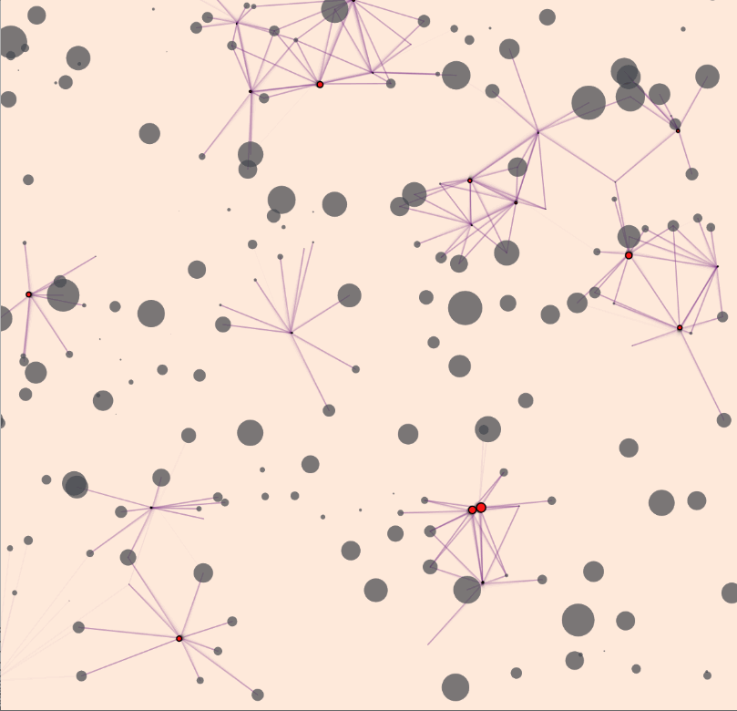

# sketches

All my  stuff goes here

# Content
 - [D3.js](#d3.js)
 - [Force](#force)
 - [p5.js](#p5.js)
 - [CSS](#css)
 - [Web Page Design](#web-page-design)
 - [Due](#due)
 - [Incomplete](#incomplete)

---
---
---
## D3.JS (Data driven Documents)
 - **Bar Chart**
   - ### [Bar Chart Generator](https://prem-jeet.github.io/sketches/d3/barChart/1.0)
        <a href="https://prem-jeet.github.io/sketches/d3/barChart/1.0">
   - ### [Bar Chart Animated](https://prem-jeet.github.io/sketches/d3/barChart/2.0)
        <a href="https://prem-jeet.github.io/sketches/d3/barChart/2.0">
   - ### [Line graph with Data Change feature](https://prem-jeet.github.io/sketches/d3/changinglines)
        <a href="https://prem-jeet.github.io/sketches/d3/changinglines">
 - **Clustering**
   - ### [Simple](https://prem-jeet.github.io/sketches/d3/clustering/1.0)
        <a href="https://prem-jeet.github.io/sketches/d3/clustering/1.0">
   - ### [With feature to change Data Set](https://prem-jeet.github.io/sketches/d3/clustering/2.0)
        <a href="https://prem-jeet.github.io/sketches/d3/clustering/2.0">
   - ### [With moving data points](https://prem-jeet.github.io/sketches/d3/clustering/moving_cluster)
        <a href="https://prem-jeet.github.io/sketches/d3/clustering/moving_cluster">
 - ### [Landing Page](https://prem-jeet.github.io/sketches/d3/landingPage)
      <a href="https://prem-jeet.github.io/sketches/d3/landingPage">
 - ### [Normal Distribution](https://prem-jeet.github.io/sketches/d3/normaldistribution)
      <a href="https://prem-jeet.github.io/sketches/d3/normaldistribution"> 
---
---
---
## FORCE
  - ### [Simple Crawler in p5](https://prem-jeet.github.io/sketches/force/particle_moving_interacing)
       <a href="https://prem-jeet.github.io/sketches/force/simple_crawler_inp5">
  - ### [Simple Crawler in svg](https://prem-jeet.github.io/sketches/force/particle_interaction_svg) 
       <a href="https://prem-jeet.github.io/sketches/force/simple_crawler_inSVG">
  - ### [Crawler and Particle System with force](https://prem-jeet.github.io/sketches/force/particle_crawler_with_force_p5) 
       <a href="https://prem-jeet.github.io/sketches/force/particle_crawler_with_force_p5">

---
---
---

## p5.JS
  
  - ### [Flow Field](https://prem-jeet.github.io/sketches/p5/Flow_field)
       <a href="https://prem-jeet.github.io/sketches/p5/Flow_field">
  
  - ### [Perceptron](https://prem-jeet.github.io/sketches/p5/perceptron)
  
  - ### [International Space Station Tracking](https://prem-jeet.github.io/sketches/p5/ISSmap)
  
  - ### [weather](https://prem-jeet.github.io/sketches/p5/weather)

  
---
---
---
## CSS
  
  - ### [Horizontal Snap Scrolling](https://prem-jeet.github.io/sketches/css/horizontalSapScroll)
       <a href="https://prem-jeet.github.io/sketches/css/horizontalSapScroll">
 
  - ### [Vertical Snap Scrolling](https://prem-jeet.github.io/sketches/css/verticalSnapScrolling)
       <a href="https://prem-jeet.github.io/sketches/css/verticalSnapScrolling">

  - ### [Window Resize Monitor](https://prem-jeet.github.io/sketches/css/windowResizeMonitor)
       <a href="https://prem-jeet.github.io/sketches/css/windowResizeMonitor">

---
---
---

## Web Page Design

 - ### [Responsive Cactus Website Landing Page](https://prem-jeet.github.io/sketches/frontendDesign/cactus_landing_page)

---
---
---

## DUE

  - ### [Linear Regression](https://prem-jeet.github.io/sketches/due/LinearRegression)

  - ### [GIFY](https://prem-jeet.github.io/sketches/due/gifify)

  - ### [Titanic DaatSet](https://prem-jeet.github.io/sketches/due/titanic)

---
---
---

## INCOMPLETE

  - ### [FunctionVisualization(y = x^2)](https://prem-jeet.github.io/sketches/incomplete/functionVisual)
       <a href="https://prem-jeet.github.io/sketches/incomplete/functionVisual">

---
---
---

Note : If working with api's which allow only HTTP request
       ADD : "https://cors-anywhere.herokuapp.com/"
          before the api HTTP url to be able to use it in github gh-pages hosting
          (as hosting gh-pages only allows HTTPS request if a custom domain is not set i.e if              
          you are using the default github provided domain)

